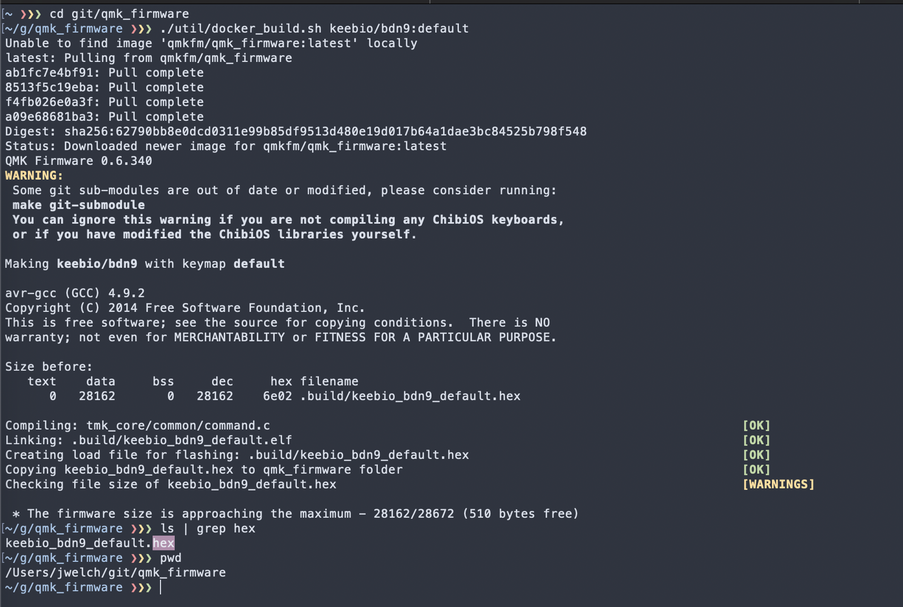
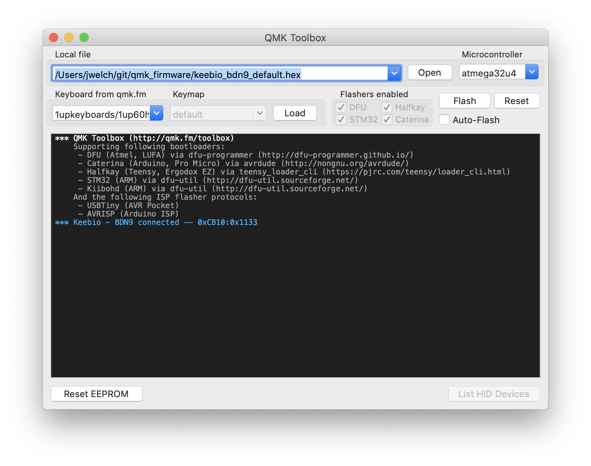
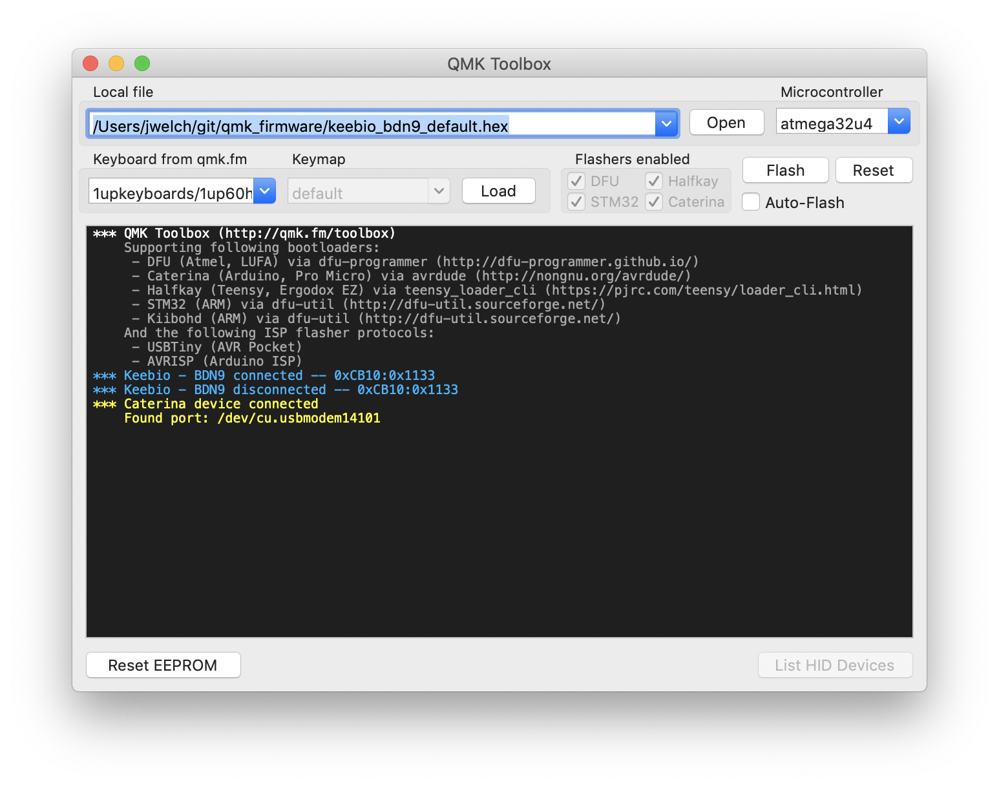
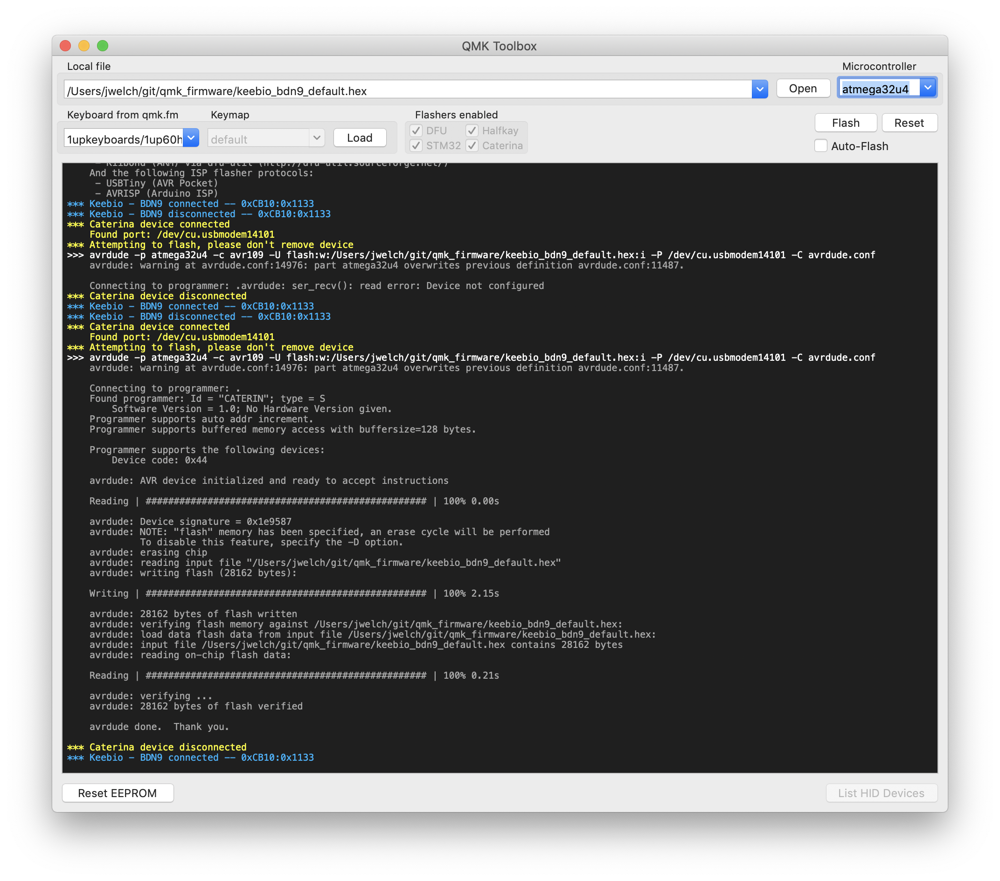
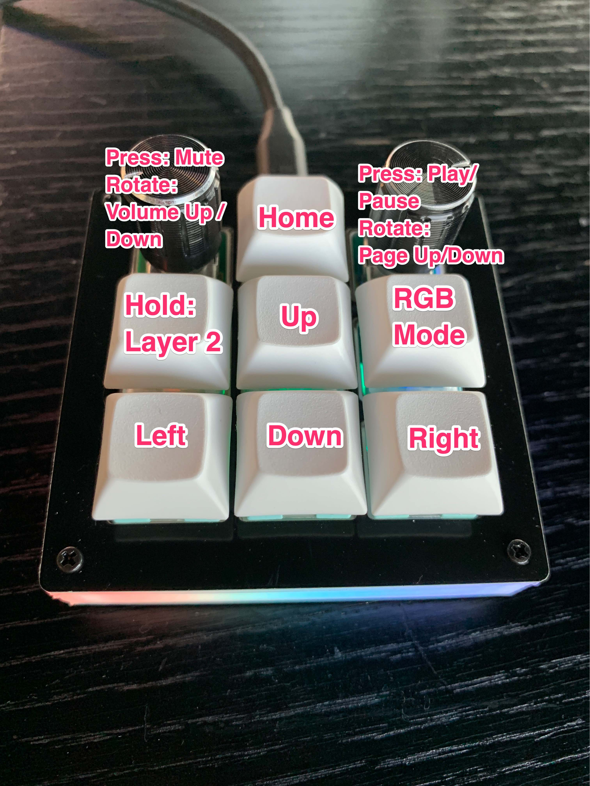
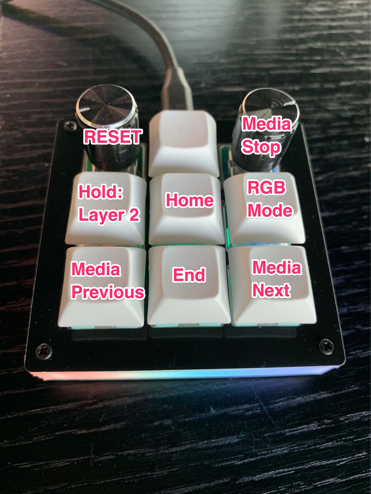
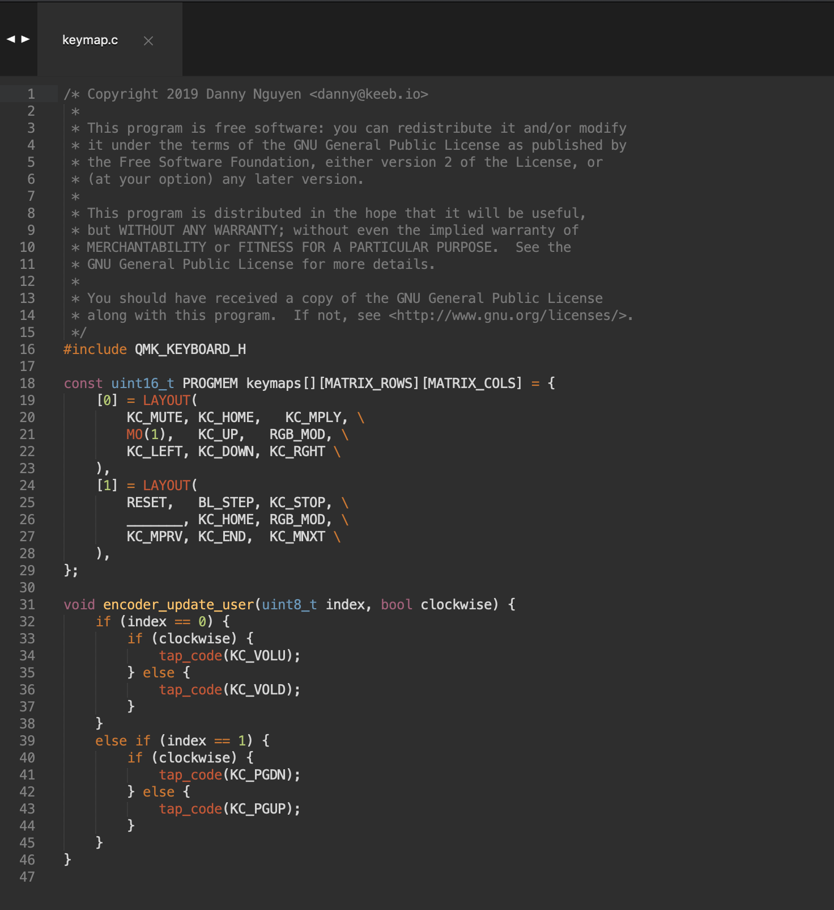

# QMK Guide

### What is QMK?

QMK is an open source keyboard firmware that supports a ton of different keyboards and micro controllers.

### What are we building?

https://keeb.io/products/bdn9-3x3-9-key-macropad-rotary-encoder-support?variant=15959960944734

### How to get/find help

## Getting setup

Regardless of the method of setup for compiling the firmware, the QMK Toolbox the easiest way to flash firmware.

1. Make sure you have brew installed, get it [here](https://brew.sh/)

2. Brew install ALL THE THINGS!

```bash
brew tap osx-cross/avr
brew install avrdude
brew cask install docker  # You may already have docker for mac, so skip this if you do
brew cask install caskroom/drivers/qmk-toolbox
```

3. Make sure they work

    a. Open the Docker for Mac application to run the docker daemon

    b. Open the QMK Toolbox application to make sure its working, you'll use this later to flash the firmware onto the keyboard.


## Compiling the default firmware

1. Make sure you have the qmk_firmware git repository checked out

```bash
git clone https://github.com/qmk/qmk_firmware.git
cd qmk_firmware
```

2. Run the utility script to compile the `default` layout for the BDN9 in the Keep.io directory

```bash
# The target keyboard has the form <path-to-keyboard>:<layout folder>.
./util/docker_build.sh keebio/bdn9:default
# this will output the hex into the root qmk_firmware directory
ls | grep hex
# keebio_bdn9_default.hex
```



## Flashing the default firmware

Full docs: https://docs.qmk.fm/#/newbs_flashing

1. Open QMK Toolbox

2. Make sure the macropad is connected, you should see it show up in the Toolbox



3. Select the `keebio_bdn9_default.hex` that was built in the previous section

4. Press the reset button on the macropad

> NOTE: If you see this in the output, then press the reset button again or turn off bluetooth and press it again until you see something like `Found port: /dev/cu.usbmodem1401`

```
*** Caterina device connected
    Found port: /dev/cu.Bluetooth-Incoming-Port
```



5. Click the 'Flash' button
6. You should see output like this



## Customizing the layout

These are the default layers





1. Make sure you have the qmk_firmware git repository checked out
2. Run the helper script to bootstrap a new layout

```bash
./util/new_keymap.sh keebio/bdn9 $USER
```

This will output something like this: 

```bash
jwelch92 keymap directory created in: qmk_firmware/keyboards/keebio/bdn9/keymaps/

Compile a firmware file with your new keymap by typing:
   make keebio/bdn9:jwelch92
from the qmk_firmware directory
```

3. Open the resulting `keymap.c` file in your favorite code/text editor

```
subl keyboards/keebio/bdn9/keymaps/$USER/keymap.c
```

4. You should see this keymap layout



5. Check out the QMK docs or our examples in this repo to start customizing!

#### Docs

QMK Docs: https://docs.qmk.fm/#/newbs_building_firmware?id=customize-the-layout-to-your-liking

Keycodes: https://docs.qmk.fm/#/keycodes

Advanced keycodes: https://docs.qmk.fm/#/feature_advanced_keycodes

Lighting: https://docs.qmk.fm/#/feature_rgblight

Tap dance: https://docs.qmk.fm/#/feature_tap_dance

Unicode: https://docs.qmk.fm/#/feature_unicode

Debugging: https://docs.qmk.fm/#/newbs_testing_debugging & https://docs.qmk.fm/#/faq_debug (edited) 

#### Example layouts (Thanks @vosechu !)

Simple browser layout: https://github.com/qmk/qmk_firmware/blob/master/keyboards/keebio/bdn9/keymaps/vosechu-browser/keymap.c

Complicated KSP layout: https://github.com/qmk/qmk_firmware/blob/master/keyboards/keebio/bdn9/keymaps/vosechu-ksp/keymap.c

Going farther yet!: https://github.com/musl/nr-offsite-mech-keys/tree/master/hotkey_reassigning
